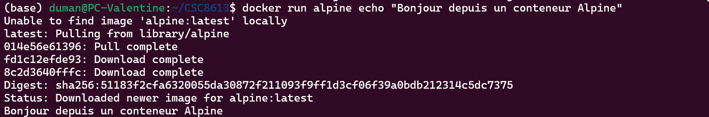

# Rapport TP1

## Exercice 1 : Installation de Docker et vérification de l'environnement

### Questions 1.a et 1.b
Docker a été installé comme le montre l'éxéxution de la commande suivante:
```bash
docker run hello-world
```


### Question 1.c
On peut vérifier que le conteneur s'est exécuté correctement:
```bash
docker ps -a
```


## Exercice 2 : Premiers pas avec Docker : images et conteneurs

### Question 2.a
Une image Docker est un modèle pour faire des conteneurs Docker. Elle est statique et contient tout ce qu'il faut pour que l'application fonctionne. Le conteneur est l'instance en exécution de cette image. On obtient une image en exécutant un DockerFile qui contient les instructions de création. Puis on obtient le conteneur en runnant notre image.


### Question 2.b
Nous allons exécuté la commande suivant:
```bash
docker run alpine echo "Bonjour depuis un conteneur Alpine"
```

Voici ce qu'on a après exécution:


Docker n'a pas réussi à trouver l'image en local, donc il la cherche dans ses librairies Docker Hub, la télécharge. Tout s'est bien exécuté puisqu'on a eu le echo. Enfin le conteneur s'est arrété.

### Question 2.c
Maintenant, on peut remarquer que 2 conteneurs se sont lancés et arrétés :
```bash
docker ps -a
```


Nos conteneurs se sont arrêtés car ils ne vivent que tant que leur processus principal est en cours d'exécution. Leurs images ayant été téléchargées et leurs commandes ayant été réalisées, les conteneurs se terminent. Pourtant, ils ne sont pas supprimés, ils sont juste à l'arrêt.

### Question 2.d
A présent, nous lançons le conteneur en mode interractif
et nous tapons des commandes à l'intérieur.


On observe que l'invité de commande a changé. On est sur la root du conteneur et on voit ce qui s'y trouve avec ```ls```. Donc le conteneur est bien isolé de ma machine.

Avec ```uname -a```, on comprend que le conteneur partage portant bien le même OS que ma machine hôte **WSL2**.

## Exercice 3: Construire une première image Docker avec une mini-API FastAPI

### Questions 3.a et 3.b
On construite une API dans le fichier /api/app.py. Pour cela, il est nécessaire de configurer la Dockefile pour créer notre image Docker avec toutes les dépendances nécessaires à notre application.

### Question 3.c
Une fois les 2 créés, on va lancer le build du docker. Pour cela, on se place dans le dossier api et on lance:
```bash
docker build -t simple-api .
```


Le build s'est bien terminé.

## Exercice 4: Exécuter l’API FastAPI dans un conteneur Docker

### Question 4.a
On lance maintenant un conteneur en exécutant l'image simple api:
```bash
docker run -p 8000:8000 simple-api
```

Grâce à cette commande docker a runné le conteneur sur son port 8000 mais la exposé en local sur le port 8000 de ma machine. On peut donc y accéder depuis un moteur de recherche.
Tout à l'air de fonctionné -> code 200


### Question 4.b
On peut tester que le endpoint **/health** nous renvoie bien ce qu'il faut.


La réponse JSON est bien celle attendue.

### Question 4.c
Maintenant, nous allons afficher la liste des conteneurs en cours d'execution.


Il n'y a que le conteneur simple-api en cours d'exécution. Avec comme nom **upbeat-galileo**, comme image utilisée **simple-api** et comme port mappé **0.0.0.0:8000->8000/tcp**.

### Question 4.d
On stoppe maintenant le conteneur en récupérant son id **28e877056d1e**.


En effet, il n'apparait plus dans ```docker ps```. On peut, cependant voir qu'il est encore disponible dans ```docker ps -a```


En réalité,  ```docker ps``` affiche les conteneurs en cours d'exécution et ```docker ps -a``` liste les conetneurs qu'ils soient actifs, arrêtés ou en erreur. Ces conteneurs existent toujours sur le disque dur.

## Exercice 5: Démarrer un mini-système multi-conteneurs avec Docker Compose

### Question 5.a et 5.b
On va créer un fichier docker-compose.yml à la racine pour permettre de lancer plusieurs services en une commande.

Puis nous le remplissons afin de définir un service db basé sur l'image officielle de postgres:16, un service api qui utilise notre Dockerfile, des variables d'environnements, les ports nécessaires. 

### Question 5.c
Nous lançons tous les services en arrière plan.


Les deux services db et api sont bien en train de tournés.


### Question 5.d
On peut vérifier que l'API est bien lancée:


### Question 5.e
Puis on arrête les conteneurs avec:
```bash
docker compose down
```


Cette commande est différente de ```docker stop``` qui se contente d'arrêter l'exécution d'un conteneur spécifique tout en le gardant sur le disque. ```docker compose down```  arrête tous les services de l'application et supprime définitivement les conteneurs associés. Mais il ne détruit pas les volumes (données présentes dans la db par exemple) comme ```docker compose down -v```

## Exercice 6: Interagir avec la base de données PostgreSQL dans un conteneur

### Question 6.a
On va redémarrer le Docker compose.


Puis on va ouvrir un shell psql à l'intérieur du conteneur PostgreSQL avec la commande
```bash
docker compose exec db psql -U demo -d demo
```

```exec``` permet de lancer une commande à l'intérieur du conteneur déjà en cours ```db```. ```-U demo``` est une option de la commande psql, où l'on spécifie l'utilisateur qui se connecte à la base PostgreSQL et ```-d demo``` est aussi une option qui spécifie le nom de la base de donnée à laquelle se connecter.

### Question 6.b
Ensuite, on exécute les requêtes ci-dessous:


Donc la première requête cherche à afficher la version de PostgreSQL. Dans notre cas c'est celle spécifiée dans le docker-compose.yml -> 16.
La deuxième requête confirme qu'on s'est connecté à la base demo.

### Question 6.c
Depuis un autre service Docker soit l'api, on peut se connecter à la base avec les paramètres suivants:
- hostname : **db**
- port: **5432**
- utilisateur: **demo**
- mot de passe: **demo**
- bdd: **demo**
Ce sont les valeurs spécifiées dans le docker-compose.yml.

## Exercice 7: Déboguer des conteneurs Docker : commandes essentielles et bonnes pratiques

### Question 7.a
On va affiché en continue les logs du service api excuté par Docker Compose :


On voit avec ces logs que l'Api démarre correctement ```Application startup complete``` et ```Uvicorn runnin on http://0.0.0.0:8000```

Lorsqu'on refresh la page /health on nous indique dans la log que la méthode utilisée est ```GET``` qui appele le chemin ```/health``` et que le code retour est ```200 OK``` donc que la requête est réussie.

### Question 7.b
Pour débugger, il est aussi possible de rentrer dans un conteneur en cours d'exécution.


Ici on a ouvert un shell dans le service api. On remarque qu'on y retrouve bien app.py et que la version de python est bien celle spécifiée dans le dockerfile de l'app.

### Question 7.d
Nous allons introduire une erreur dans app.py en renommant la variable **app** en **appi**. Nous recréons l'image **simple-api** et relançons Docker compose puis obervons les logs:

```bash
docker build -t simple-api .
docker compose up -d --build
docker compose logs -f api
```

C'est dans les logs du Docker Compose que nous voyons le message d'erreur. Sinon avec la construction de l'image et sans l'affichage des logs, on ne voit pas qu'il y a une erreur. C'est lorsqu'on créer le conteneur que le d'après le Dockerfile, la commande de démarage ```CMD ["uvicorn", "app:app", ...]``` doit être exécutée. Mais la variable app n'est pas trouvée dans le fichier app.py.

### Question 7.e
On finit par supprimer tous les conteneurs arrêtés et images inutilisées.


Il est important de faire un peu de nettoyage car Docker ne supprime rien par lui même. DOnc des fichiers peuvent s'accumuler et saturer l'espace de stockage. Plus c'est plus lisible et on évite des erreurs de conflits.

## Exercice 8: Questions de réflexion et consignes pour le rendu

### Question 8.a
Le notebook Jupyter est déprécié lorsqu'il faut déployer un modèle en production car il n'est pas reproductible. Les dépendances dépendent souvent de la machine locale et ne sont pas figées et il n'est pas possible d'autromatiser l'execution des cellules comme on le ferait avec CMD d'un Dockerfile.

### Question 8.b
Docker Compose est essentiel pour orchestrer plusieurs conteneurs via une seule configuration. Il gère automatiquement son réseau et il n'y a pas besoin de configurer des adresses Ip manuellement.